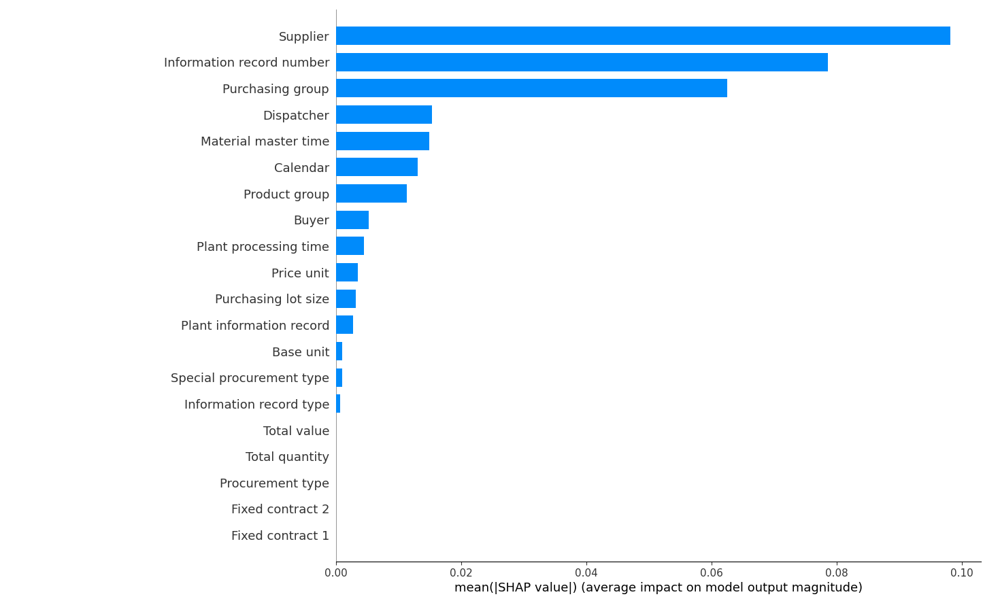

# Neural Network Implementation

## Introduction

This project implements a simple neural network (NN) using PyTorch for binary classification tasks. The network architecture consists of three fully connected layers.

## Architecture

The neural network (`SimpleNN`) architecture is as follows:

- Input layer: Accepts input data of size `input_size`.
- Hidden layers:
  1. Fully connected layer (16 neurons) with ReLU activation.
  2. Fully connected layer (8 neurons) with ReLU activation.
- Output layer:
  - Fully connected layer (1 neuron) with sigmoid activation (outputting probabilities).

## Training Process

### Data Preprocessing

Data preprocessing is crucial and involves the following steps:

1. **Handling Zeros**: Certain columns with zero values are replaced with NaN.
2. **Data Loading**: Training and validation datasets are loaded from CSV files.
3. **Drop Columns**: Unnecessary columns ('Material number', 'Plant') are dropped.
4. **Categorical Encoding**: Categorical columns are label-encoded.
5. **NaN Handling**: NaN values are imputed using the most frequent value in each column.
6. **Standardization**: Numerical columns are standardized using `StandardScaler`.

### Model Training

The model (`SimpleNN`) is trained using the following parameters:

- Loss function: Binary Cross-Entropy Loss (`BCELoss`)
- Optimizer: Adam optimizer with a learning rate of 0.001
- Epochs: 10

### Model Evaluation

After training, the model is evaluated on a validation set using the following metrics:

- Validation Loss
- Accuracy
- Precision
- Recall
- F1-score
- Confusion Matrix

### Inference

Inference (`infer.py`) involves:

1. Loading the trained model.
2. Preprocessing new data using saved preprocessing objects (`LabelEncoder`, `SimpleImputer`, `StandardScaler`).
3. Running inference on the new data to predict anomalies.

### Feature Importance

Feature importance (`main.py`) is determined using SHAP (SHapley Additive exPlanations) to explain the model's predictions based on feature contributions.

## Files

- **algorithm.py**: Contains the `SimpleNN` class definition.
- **dataloader.py**: Loads and preprocesses training and validation data.
- **infer.py**: Loads the trained model and runs inference on new data.
- **inference_dataloader.py**: Loads and preprocesses new data for inference.
- **main.py**: Handles the main training process of the neural network.
- **saved_prep_obj/**: Directory containing saved preprocessing objects (`LabelEncoder`, `SimpleImputer`, `StandardScaler`).

## Usage

To train the model, run `main.py`. This script will train the model, evaluate its performance, and save the trained model weights. For inference on new data, use `infer.py`.

## Results
- **Validation accuracy** on the supervised test dataset: **82.74%**
- **Validation accuracy** on the human labelled anamolies dataset: **72.5%**

## Feature importance
