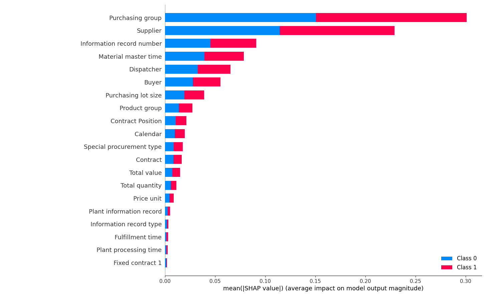

# Random Forest Classifier 

## Overview
Implementation of the Random Forest Classifier (RFC) for anomaly detection. The implementation consists of two main parts:
1. Training the RFC model (rfc_new.py).
2. Using the trained RFC model for inference on new data (rfc_inference.py).
The results and saved objects are stored in separate folders within the RFC algorithm directory, namely `results` and `saved_prep_obj` respectively.

## Usage 

### Training
1. Ensure your training and validation data are in the specified paths.
2. Run `rfc_new.py` to train the model and save preprocessing objects.

### Inference
1. Place the new data in the specified path.
2. Run `rfc_inference.py` to get predictions and save results.

## Results
- **Validation accuracy** on the supervised test dataset: **95.8%**
- **Validation accuracy** on the human labelled anamolies dataset: **94.97%**

## Feature importance

